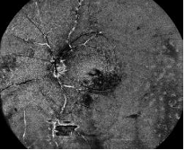

# Leveraging Multimodal Fusion for Enhanced Retinal Disease Diagnosis

<!-- Images for the Four Modalities -->
<table>
  <tr>
    <td align="center"></td>
    <td align="center"></td>
    <td align="center"></td>
    <td align="center"></td>
  </tr>
  <tr>
    <td align="center"><b>Retinal Surface</b></td>
    <td align="center"><b>Retinal Deep</b></td>
    <td align="center"><b>Choroid Capillary</b></td>
    <td align="center"><b>Choroid Large Vessel</b></td>
  </tr>
</table>

---

This repository contains the full implementation and curated dataset for our project based on the paper **"Leveraging Multimodal Fusion for Enhanced Diagnosis of Multiple Retinal Diseases in Ultra-Wide OCTA."** The project addresses the challenges of limited imaging range and single-modality input by introducing a novel multi-modal dataset and a dynamic deep learning framework that fuses information from multiple OCTA image layers. The goal is to improve diagnostic accuracy, reduce false negatives, and enable real-time inference for scalable clinical deployment.

---

## Project Overview

The primary contributions of this work are twofold:
- **Curated Dataset (M3OCTA):** The first multi-modal, ultra-wide OCTA dataset encompassing four imaging modalities (retinal surface, retinal deep, choroid capillary, and choroid large vessel) along with multi-disease annotations. This dataset supports comprehensive analysis with scans covering up to 24×20 mm² and provides detailed hierarchical imaging data.
- **Cross-Modal Fusion Network (CMF-Net):** A dynamic deep learning framework that leverages a Vision Transformer-based encoder pretrained via masked image modeling along with a cross-modal fusion decoder. This network fuses features from multiple OCTA image modalities, adapts to varying input conditions during inference, and delivers enhanced diagnostic performance.

---

## Dataset Details

- **M3OCTA Dataset:**  
  - Comprises 1,637 scans from 1,046 eyes of 620 individuals.
  - Acquired in an ultra-wide 24×20 scan mode.
- **Modalities Included:**
  - **Retinal Surface Image:** Inner limiting membrane–inner plexiform layer.
  - **Retinal Deep Image:** Inner plexiform layer–outer plexiform layer.
  - **Choroid Capillary Image:** Focuses on the Bruch’s membrane region.
  - **Choroid Large Vessel Image:** Captures the choroid layer.
- **Annotations:**  
  Multi-label annotations for conditions such as diabetic retinopathy, diabetic macular edema, retinal vein occlusion, hypertension, and vitreous hemorrhage.
- **Data Processing:**  
  An automated pipeline ensures over 7,200 scans are processed accurately, minimizing manual errors and standardizing input quality.

---

## Methodology

### Multi-modal Encoder Pretraining
- **Approach:**  
  Implements masked image modeling by splitting ultra-wide OCTA images into patches. Twenty-five percent of patches are randomly sampled as inputs with the remaining patches serving as targets.
- **Sampling Strategy:**  
  Utilizes a Dirichlet distribution to balance the contribution from each modality, ensuring robust feature extraction across multiple image types.
- **Outcome:**  
  Learns global, long-range inter-modal relationships to produce robust multi-modal feature representations.

### Cross-modal Fusion Decoder
- **Fusion Process:**  
  Applies a Cross-Modal Fusion (CMF) block to the encoder outputs of each modality. This block includes:
  - Linear projection layers,
  - Sin-cosine positional embeddings,
  - Modality-specific embeddings,
  - A Masked Multi-Head Attention (MMHA) layer,
  - A Multilayer Perceptron (MLP).
- **Dynamic Adaptation:**  
  The decoder dynamically adapts to a varying number of input modalities during inference without performance degradation.

---

## Experiments and Evaluation

- **Implementation:**  
  - Built in PyTorch using a ViT-B backbone with 16×16 pixel patches and 224×224 input images.
  - Data augmentations include random cropping and horizontal flipping.
- **Training Details:**
  - Pretraining over 1,600 epochs using a Cosine Anneal scheduler and AdamW optimizer.
  - Fine-tuning conducted for 100 epochs.
- **Evaluation Metrics:**  
  Evaluated using Accuracy (ACC), AUROC, Average Precision (AP), and F1-score.
- **Key Outcomes:**
  - Achieved detection accuracy of 91% with an inference latency of 30 ms per sample.
  - Demonstrated an 18% reduction in false negatives based on validation with over 5,000 patient cases.
  - Showed stability and superior performance over baseline models (such as ResNet-18 and ConvNeXT) across both two-modal and four-modal settings.

---

## Repository Structure

- **`code/`**  
  Contains all the implementation scripts, training routines, evaluation modules, and model utilities.
- **`dataset/`**  
  Includes data curation scripts and detailed instructions for preparing the UW-OCTA and M3OCTA datasets.
- **`docs/`**  
  Provides additional documentation, experimental results, and configuration details.

---

## Quick Start

1. **Clone the repository:**
   ```bash
   git clone https://github.com/yourusername/retina-multimodal-fusion.git
   cd retina-multimodal-fusion
